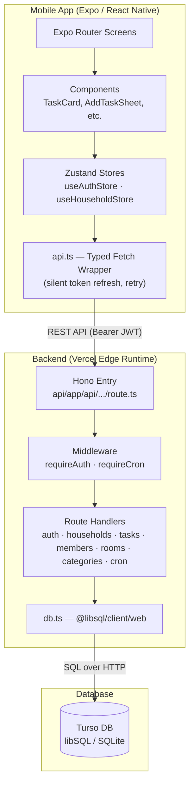

# Chorify

> An iOS-first family chore management app for sharing tasks, tracking completions, and competing on a weekly leaderboard.

## What It Does

Chorify helps families and households stay organized by providing a central place to manage chores and tasks. Users can create or join a household via an invite code, add tasks with specific recurrence schedules (daily, weekly, biweekly, monthly, quarterly, annual, or custom), assign them to members, and track who has completed what.

The core of the app is a shared task list and a weekly leaderboard that fosters friendly competition by tracking completions. The app is designed to be simple and intuitive, with features like customizable rooms and categories, CSV import/export for power users, and push notifications to remind members of upcoming or overdue tasks. It is built for iOS first, with full support for tablet (iPad) layouts.

## Live Demo

A live demo is not available as this is a native mobile application. To see the app in action, build and run it on an iOS simulator or physical device using the instructions below.

*To create a preview GIF: Run the app in the iOS simulator, use `Cmd+Shift+5` on macOS to record a short video of the main features (adding a task, completing a task, viewing the leaderboard), convert the video to a GIF, and embed it here.*

## Tech Stack

| Area | Technology | Version / Details |
|---|---|---|
| Mobile App | React Native | 0.81.5 (via Expo SDK 54) |
| Framework | Expo | SDK 54 |
| Routing | Expo Router | v6, file-based routing |
| State Management | Zustand | v5.0 — two stores: auth + household data |
| API Backend | Hono | v4.7 on Vercel Edge Runtime (Next.js App Router catch-all) |
| Database | Turso | libSQL/SQLite via `@libsql/client/web` (HTTP transport) |
| Authentication | Custom JWT | `jose` (HS256, 7-day expiry) + PBKDF2 passwords + refresh token rotation |
| Push Notifications | Expo Push API | Triggered by a daily Vercel Cron job at 8am PT |
| Validation | Zod | v3.24 via `@hono/zod-validator` |

## Architecture



**Data Flow:** User interactions in React Native components trigger actions on the Zustand stores (`useHouseholdStore`), which call the backend via typed wrappers in `lib/api.ts`. The `api.ts` layer injects the JWT bearer token, handles 401s with automatic silent token refresh (deduplicated via a singleton promise), and retries the failed request once. The Hono API on Vercel Edge validates authentication via middleware, processes business logic in route handlers, and executes SQL queries against Turso via `@libsql/client/web` (HTTP transport — no WebSocket or native modules). Data returns as JSON to the mobile app, where the Zustand store updates and the UI re-renders.

**State Management:** Two Zustand stores in `lib/store.ts`:
- **`useAuthStore`** — JWT tokens, decoded claims (`userId`, `householdId`, `memberId`), hydrated from SecureStore on launch
- **`useHouseholdStore`** — All household data (tasks, members, completions, rooms, categories), loaded in parallel on app mount, refreshable via pull-to-refresh. Includes optimistic update methods and a `loadError` state for full-screen retry UI

## Project Structure

```
new-chorify/
├── mobile/                       # Expo React Native app
│   ├── app/                      # Expo Router screens (file-based routing)
│   │   ├── _layout.tsx           # Root: fonts, auth hydration, splash guard
│   │   ├── index.tsx             # Entry redirect (login → onboarding → home)
│   │   ├── (auth)/               # Login + Signup screens
│   │   ├── (app)/                # Authenticated app (tab bar)
│   │   │   ├── _layout.tsx       # Tab bar; mounts push + data load
│   │   │   ├── (home)/           # Today tab — overdue / due today / completed
│   │   │   ├── family/           # Tasks tab — all tasks + leaderboard
│   │   │   └── settings/         # Settings tab + sub-screens (rooms, categories, packs, csv)
│   │   └── onboarding/           # Create or join household
│   ├── components/               # Reusable components
│   │   ├── AddTaskSheet.tsx      # Bottom sheet for creating tasks
│   │   ├── EditTaskSheet.tsx     # Bottom sheet for editing tasks
│   │   ├── TaskCard.tsx          # Task card with swipe-to-delete (PanResponder)
│   │   ├── MemberAvatar.tsx      # Photo avatar or emoji fallback
│   │   ├── Button.tsx            # Styled button with variants
│   │   ├── Input.tsx             # Styled text input with error state
│   │   └── Toast.tsx             # Animated toast notifications
│   ├── constants/
│   │   ├── colors.ts             # Color tokens, Shadows, Radius, CATEGORY_COLORS
│   │   ├── fonts.ts              # Font families (Fraunces + DM Sans) + FontSize scale
│   │   ├── layout.ts             # useLayout() hook — tablet responsiveness
│   │   └── packs.ts              # 7 predefined task pack templates
│   ├── lib/
│   │   ├── api.ts                # Typed fetch wrappers + silent token refresh
│   │   ├── store.ts              # Zustand stores (useAuthStore + useHouseholdStore)
│   │   ├── notifications.ts      # Push token registration + background fetch
│   │   ├── csv.ts                # RFC 4180 CSV parse/export
│   │   └── timezone.ts           # Timezone preference helpers
│   ├── types/index.ts            # All shared TypeScript interfaces
│   ├── app.json                  # Expo config (bundle ID, plugins, EAS project)
│   └── eas.json                  # EAS build profiles (dev, preview, production)
│
└── api/                          # Hono backend on Vercel Edge
    ├── app/api/[[...route]]/
    │   └── route.ts              # Hono entry point (Next.js App Router catch-all)
    ├── lib/
    │   ├── auth.ts               # JWT (jose) + PBKDF2 password hashing + refresh tokens
    │   ├── db.ts                 # Turso/libSQL client singleton (@libsql/client/web)
    │   ├── middleware.ts         # requireAuth + requireCron guards
    │   ├── utils.ts              # generateId, calcNextDue, todayISO
    │   └── routes/
    │       ├── auth.ts           # signup, login, refresh, logout
    │       ├── households.ts     # CRUD + join via invite code
    │       ├── tasks.ts          # CRUD + complete (advances next_due)
    │       ├── rooms.ts          # CRUD (delete sets task.room_id to NULL)
    │       ├── categories.ts     # CRUD (delete reassigns tasks; rename bulk-updates)
    │       ├── members.ts        # PATCH (name, emoji, push token, avatar)
    │       └── cron.ts           # Daily push notification dispatch
    ├── TURSO_SCHEMA.sql          # Full DB schema + migration history
    └── vercel.json               # Region (pdx1) + cron schedule (0 15 * * * UTC)
```

## Key Features

- **Task Lifecycle:** Create, view, edit (long-press with haptic feedback), and delete (swipe-left with animated spring) tasks. Optimistic store updates with confetti animation on completion.
- **Flexible Recurrence:** `daily | weekly | biweekly | monthly | quarterly | biannual | annual | once | every_N_days`. The `calcNextDue()` function advances from the existing due date (not today), correctly catching up from overdue states.
- **Household Leaderboard:** The Tasks tab ranks members by weekly completion count in a leaderboard section.
- **Filtering:** Today screen has room/category/member filter pills. Tasks screen has room/member/date filter pills. All filters are AND-combined.
- **Custom Rooms & Categories:** Users create rooms and categories with names and emojis. Categories use an 8-color palette indexed by `sort_order`. Deleting a category reassigns its tasks; renaming bulk-updates all linked tasks.
- **Member Avatars:** Photo library picker via `expo-image-picker`, resized to 200x200 JPEG via `expo-image-manipulator`, stored as base64 data URI in Turso.
- **Push Notifications:** Three modes — `task` (server push per task via cron), `daily` (local 8am notification), `none`. Background fetch updates badge count.
- **CSV Import/Export:** RFC 4180 compliant. Export includes human-readable room/member names. Import supports create (no `id`) and update (with `id`) modes.
- **Task Packs:** 7 predefined template packs (Essential Home, Dog Care, Cat Care, Parent Pack, Home Maintenance, Vehicle Care, Garden & Outdoor) for quick onboarding.

## Getting Started

### Prerequisites

| Tool | Purpose |
|------|---------|
| Node.js 20+ | JavaScript runtime |
| npm | Package manager |
| Xcode 16+ | iOS builds and simulator |
| CocoaPods | iOS dependency manager (`gem install cocoapods`) |
| Expo CLI | `npx expo start` (no global install needed) |
| EAS CLI | Cloud/local builds (`npm i -g eas-cli`) |
| Turso CLI | Database shell access |
| Vercel CLI | API deployment + local dev server |

### Installation

```bash
# Clone the repository
git clone <repo-url>
cd new-chorify

# Install mobile dependencies
cd mobile && npm install

# Install API dependencies
cd ../api && npm install
```

### Environment Variables

**API (`api/.env.local`):**

```bash
TURSO_URL=libsql://your-db-name.turso.io
TURSO_AUTH_TOKEN=your-turso-auth-token
JWT_SECRET=your-random-32-byte-hex    # openssl rand -hex 32
CRON_SECRET=your-random-16-byte-hex   # openssl rand -hex 16
```

**Mobile (`mobile/.env.local`):**

```bash
# For local dev, use your machine's LAN IP (iOS Simulator cannot use localhost)
# Find your IP: ipconfig getifaddr en0
EXPO_PUBLIC_API_URL=http://192.168.1.42:3001

# For production builds, this is set in eas.json automatically
```

### Database Setup

```bash
# Create the database (if not already created)
turso db create chorify

# Run the schema
turso db shell chorify < api/TURSO_SCHEMA.sql

# Verify tables
turso db shell chorify "SELECT name FROM sqlite_master WHERE type='table'"
```

### Running Locally

```bash
# Terminal 1 — Start the API (runs on port 3001)
cd api
vercel dev

# Terminal 2 — Start the mobile app
cd mobile
npx expo start
```

Press `i` to open in the iOS Simulator, or scan the QR code with the Expo Go app on a physical device.

> **Note:** Push notifications require a dev client build (`eas build --profile development`), not Expo Go.

## Database Schema

| Table | Key Columns | Description |
|---|---|---|
| `users` | `id`, `email`, `password_hash`, `created_at` | User accounts with PBKDF2-hashed passwords |
| `profiles` | `id` (= user_id), `household_id`, `member_id` | Links users to households and members |
| `refresh_tokens` | `id`, `user_id`, `token_hash`, `expires_at`, `used` | SHA-256 hashed refresh tokens with rotation + reuse detection |
| `households` | `id`, `name`, `invite_code`, `owner_id` | Household entity; 6-char alphanumeric invite code |
| `members` | `id`, `household_id`, `display_name`, `emoji`, `is_child`, `push_token`, `avatar_url` | Household members; `avatar_url` stores base64 data URI |
| `tasks` | `id`, `household_id`, `title`, `category`, `recurrence`, `assigned_to`, `room_id`, `next_due`, `is_private`, `owner_member_id` | Core task entity; `category` is a string (no FK), `room_id` FK with ON DELETE SET NULL |
| `completions` | `id`, `task_id`, `member_id`, `household_id`, `completed_date`, `completed_at` | Completion records; fetched for last 30 days only |
| `rooms` | `id`, `household_id`, `name`, `emoji`, `sort_order` | Customizable rooms; 5 seeded on household create |
| `categories` | `id`, `household_id`, `name`, `emoji`, `sort_order` | Customizable categories; 6 seeded on household create |

**Important schema notes:**
- `task.category` is a plain string matching `categories.name` — no foreign key constraint
- Deleting a room sets `tasks.room_id` to NULL (not cascaded)
- Deleting a category reassigns its tasks to the first remaining category; the last category cannot be deleted (409)
- Default seeds on household create: 5 rooms + 6 categories

## API Routes

All routes are defined in `api/lib/routes/` and registered in the Hono entry point.

| Method | Endpoint | Auth | Description |
|---|---|---|---|
| POST | `/api/auth/signup` | None | Create user account |
| POST | `/api/auth/login` | None | Login, returns access + refresh tokens |
| POST | `/api/auth/refresh` | None | Rotate token pair |
| POST | `/api/auth/logout` | Bearer | Invalidate refresh token |
| POST | `/api/households` | Bearer | Create household (seeds rooms + categories, re-issues JWT with `hid`+`mid`) |
| POST | `/api/households/join` | Bearer | Join via invite code |
| GET | `/api/households/:id` | Bearer | Get household info |
| GET/POST | `/api/households/:id/members` | Bearer | List / add child member |
| GET/POST | `/api/households/:id/tasks` | Bearer | List / create task |
| GET | `/api/households/:id/completions` | Bearer | Last 30 days of completions |
| GET/POST | `/api/households/:id/rooms` | Bearer | List / create room |
| GET/POST | `/api/households/:id/categories` | Bearer | List / create category |
| PATCH/DELETE | `/api/tasks/:id` | Bearer | Update / delete task |
| POST | `/api/tasks/:id/complete` | Bearer | Complete task, advance `next_due` |
| PATCH/DELETE | `/api/rooms/:id` | Bearer | Update / delete room |
| PATCH/DELETE | `/api/categories/:id` | Bearer | Update / delete category |
| PATCH | `/api/members/:id` | Bearer | Update member (name, emoji, push token, avatar) |
| GET | `/api/cron/notifications` | Cron Secret | Daily push notification dispatch |

## Design System

The design system is defined in `mobile/constants/` and must be used consistently across all screens.

### Colors (`colors.ts`)

| Token | Value | Usage |
|---|---|---|
| `primary` | `#486966` | Dark teal — CTAs, active states, checkmarks |
| `primaryLight` | `#EAF0EF` | Teal tint — selected backgrounds |
| `accent` / `danger` | `#BD2A2E` | Red — destructive actions, overdue tasks |
| `background` | `#F4F2F0` | Screen background |
| `surface` | `#FFFFFF` | Cards, sheets |
| `textPrimary` | `#3B3936` | Main text; also used as `shadowColor` (never `#000`) |
| `textSecondary` | `#889C9B` | Muted text |
| `success` | `#3D8B6C` | Completed tasks |
| `warning` | `#C87D2A` | Due today |

### Typography (`fonts.ts`)

- **Display:** `Font.displayBold` / `Font.displaySemiBold` — Fraunces (screen titles, sheet headers)
- **Body:** `Font.regular` / `Font.medium` / `Font.semiBold` / `Font.bold` — DM Sans
- **Scale:** `FontSize.xs=11` · `sm=13` · `base=15` · `md=17` · `lg=20` · `xl=24` · `2xl=30` · `3xl=36`

### Layout (`layout.ts`)

The `useLayout()` hook provides responsive values based on device width:

| Value | Phone | Tablet (>= 768pt) |
|---|---|---|
| `contentPadding` | 16 | 24 |
| `headerPadding` | 20 | 32 |
| `contentMaxWidth` | undefined | 680 |
| `sheetMaxWidth` | undefined | 560 |

### Tokens

- **Shadows:** `Shadows.sm` · `Shadows.card` · `Shadows.md` · `Shadows.lg` · `Shadows.button`
- **Radius:** `Radius.xs=6` · `sm=8` · `md=12` · `lg=16` · `xl=20` · `2xl=28` · `full=9999`
- **Category Colors:** 8-color palette via `getCategoryColor(sort_order)` returning `{ bg, text }`

## Building for TestFlight

### EAS Local Build (preferred, unlimited)

```bash
cd mobile

# Production build (API URL set automatically from eas.json)
eas build --platform ios --profile production --local

# Submit to TestFlight
eas submit --platform ios --latest
```

### Xcode Archive (manual)

```bash
cd mobile
npx expo prebuild --platform ios --clean
cd ios && pod install && cd ..
open ios/Chorify.xcworkspace
# Xcode: Product → Archive → Distribute → App Store Connect
```

### Quick On-Device Testing

```bash
# Installs debug build directly on connected device + starts Metro
cd mobile && npx expo run:ios --device
```

## Deployment

### Backend API

The API is deployed manually to Vercel (not connected to Git):

```bash
cd api
npx vercel --prod
```

Production URL: configured in `eas.json` under `build.production.env.EXPO_PUBLIC_API_URL`.

> **Warning:** `npx vercel env pull` will overwrite `api/.env.local` with Vercel's Development env, which lacks production secrets. Back up your `.env.local` first.

### Database Migrations

Before shipping a new build, verify any schema changes are applied:

```bash
# Check current columns
turso db shell chorify-theronv "PRAGMA table_info(tasks)"

# Apply any missing ALTER TABLE statements from TURSO_SCHEMA.sql
turso db shell chorify-theronv "ALTER TABLE ..."
```

### Cron Job

A single Vercel Cron job runs at `0 15 * * *` UTC (8am PT) to send push notifications. Configured in `api/vercel.json`.

## Backend Smoke Test

A Python smoke test (41 checks) verifies all endpoints against the production API before shipping builds. It creates a throwaway account, exercises every route, and cleans up. See `DEVELOPER_GUIDE.md` section 18 for the full script.

```bash
python3 smoke_test.py
```

## Known Limitations

- **List Performance:** Task lists use `ScrollView` + `.map()` instead of a virtualized list. Performance may degrade with large task counts (50+). A migration to `@shopify/flash-list` is planned.
- **Streak Accuracy:** Completion streaks are calculated from the last 30 days of fetched data. Streaks longer than 30 days will be under-counted.
- **Avatar Storage:** Avatars are stored as base64 JPEG data URIs directly in the Turso database (~15-50KB each). This works at household scale but does not scale to large user bases.
- **Edge Runtime Constraints:** The API cannot use Node.js native modules (`crypto`, `fs`, `path`). Only Web Crypto API (`jose`, PBKDF2) and HTTP-based clients (`@libsql/client/web`) are compatible.

## Contributing

- **Branch Strategy:** Create feature branches off `main` (e.g., `feat/add-undo-toast`, `fix/logout-data-leak`).
- **Console Logging:** All `console.log` statements must be gated behind `if (__DEV__)` — production logs leak tokens.
- **API Calls:** Never call the API directly from components. Use typed wrappers in `lib/api.ts`.
- **Categories:** Never hardcode category strings. Always read from `useHouseholdStore(s => s.categories)`.
- **Colors:** Always use tokens from `constants/colors.ts`, never raw hex values.
- **Shadows:** Always use `Colors.textPrimary` as `shadowColor`, never `#000`.
- **Back Buttons:** Use `<Ionicons name="chevron-back" />`, not text-based back buttons.
- **File System:** Use `expo-file-system/legacy` (not `expo-file-system`) for `writeAsStringAsync` / `EncodingType` in SDK 54.

For the full developer reference, see [`DEVELOPER_GUIDE.md`](./DEVELOPER_GUIDE.md).
For the app audit and known issues, see [`AUDIT.md`](./AUDIT.md).
